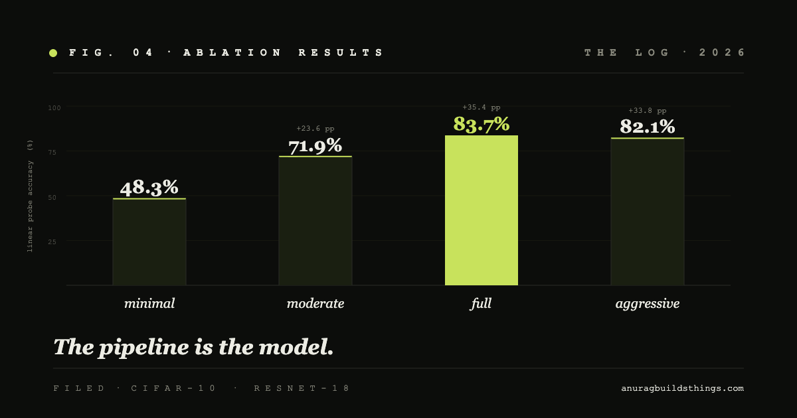
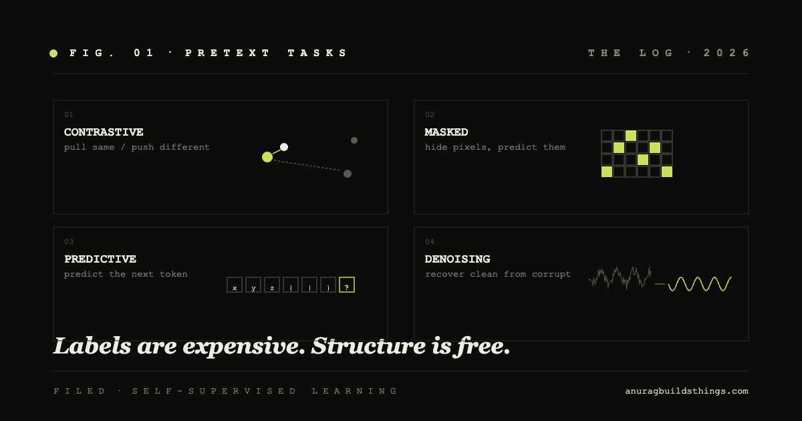
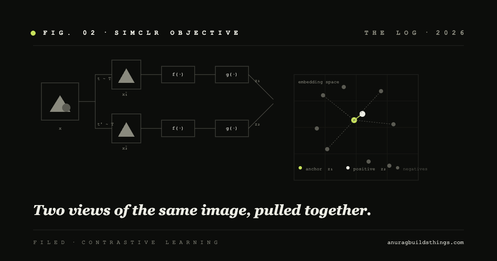
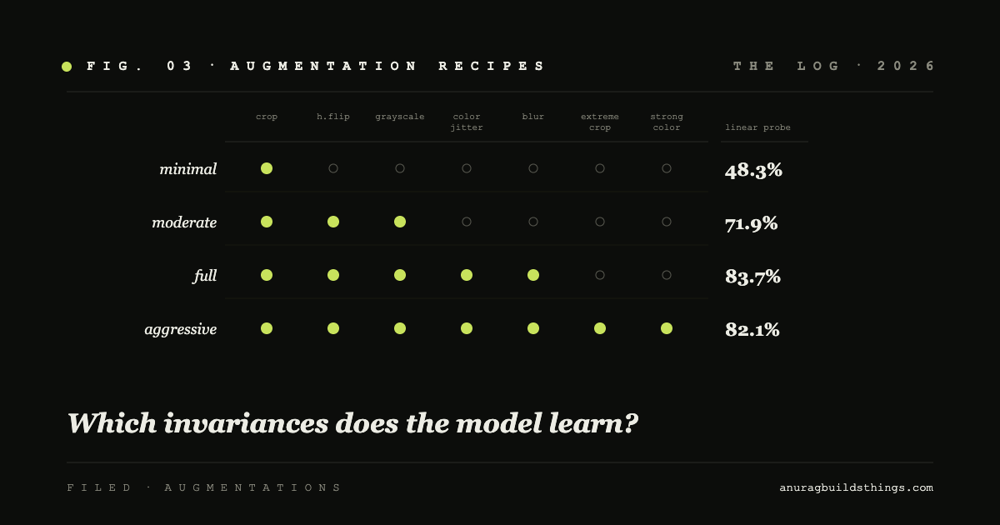

# anurag builds things

# anurag builds  intelligent systems  

I build things to understand how they actually work. A question, a system built to answer it, a comparison against real data. Just the code, the curves, and what they actually mean.

### [Augmentations Are the Model](posts/augmentations-are-the-model.llms.md)

Four augmentation recipes on CIFAR-10, held constant everywhere else. The result isn’t subtle - and the pattern has a cleaner explanation than ‘stronger is better’.

15 Apr 2026

### [Self-Supervised Learning](posts/self-supervised-learning.llms.md)

Core intuition behind self-supervised learning: why it works, when to use it, and how it connects to real systems.

18 Mar 2026

### [Learning Representations Without Labels (SimCLR)](posts/ssl-representation.llms.md)

Implementing SimCLR from scratch to learn visual representations without labels using contrastive learning on CIFAR-10.

18 Mar 2026

### [Why Augmentations Matter in Contrastive Learning](posts/why-augmentations-matter.llms.md)

Testing how different augmentation strategies affect representation quality in SimCLR-style contrastive learning.

18 Mar 2026

![](data:image/svg+xml;base64,PHN2ZyBjbGFzcz0icGFsZXR0ZS1pY29uIiB2aWV3Ym94PSIwIDAgMjQgMjQiIGZpbGw9ImN1cnJlbnRDb2xvciIgd2lkdGg9IjIwIiBoZWlnaHQ9IjIwIiBhcmlhLWhpZGRlbj0idHJ1ZSI+CiAgICAgICAgPHBhdGggZD0iTTE2LjA0MSAxNS44NTZjLTAuMDM0IDAuMDI2LTAuMDY3IDAuMDU1LTAuMDk5IDAuMDg3cy0wLjA2MCAwLjA2NC0wLjA4NyAwLjA5OWMtMS4yNTggMS4yMTMtMi45NjkgMS45NTgtNC44NTUgMS45NTgtMS45MzMgMC0zLjY4Mi0wLjc4Mi00Ljk1LTIuMDUwcy0yLjA1MC0zLjAxNy0yLjA1MC00Ljk1IDAuNzgyLTMuNjgyIDIuMDUwLTQuOTUgMy4wMTctMi4wNTAgNC45NS0yLjA1MCAzLjY4MiAwLjc4MiA0Ljk1IDIuMDUwIDIuMDUwIDMuMDE3IDIuMDUwIDQuOTVjMCAxLjg4Ni0wLjc0NSAzLjU5Ny0xLjk1OSA0Ljg1NnpNMjEuNzA3IDIwLjI5M2wtMy42NzUtMy42NzVjMS4yMzEtMS41NCAxLjk2OC0zLjQ5MyAxLjk2OC01LjYxOCAwLTIuNDg1LTEuMDA4LTQuNzM2LTIuNjM2LTYuMzY0cy0zLjg3OS0yLjYzNi02LjM2NC0yLjYzNi00LjczNiAxLjAwOC02LjM2NCAyLjYzNi0yLjYzNiAzLjg3OS0yLjYzNiA2LjM2NCAxLjAwOCA0LjczNiAyLjYzNiA2LjM2NCAzLjg3OSAyLjYzNiA2LjM2NCAyLjYzNmMyLjEyNSAwIDQuMDc4LTAuNzM3IDUuNjE4LTEuOTY4bDMuNjc1IDMuNjc1YzAuMzkxIDAuMzkxIDEuMDI0IDAuMzkxIDEuNDE0IDBzMC4zOTEtMS4wMjQgMC0xLjQxNHoiIC8+CiAgICAgIDwvc3ZnPg==) ⌘K

All 0

Posts 0

Sections 0

Actions 0

↑↓navigate ↩open ⌘↩new tab escclose

search
