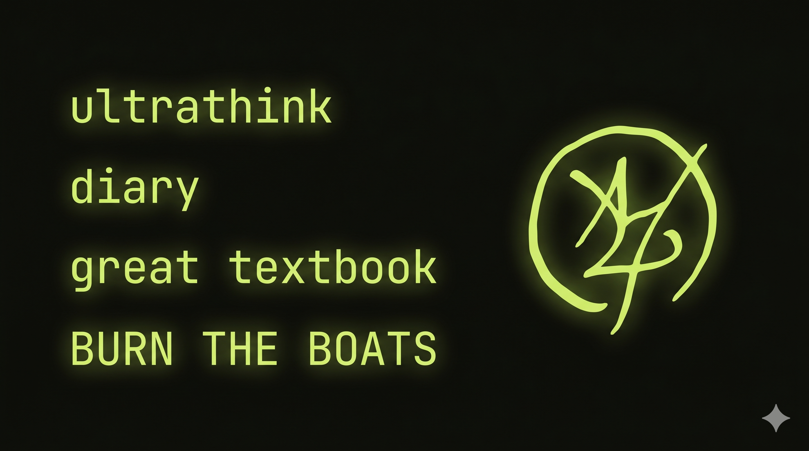
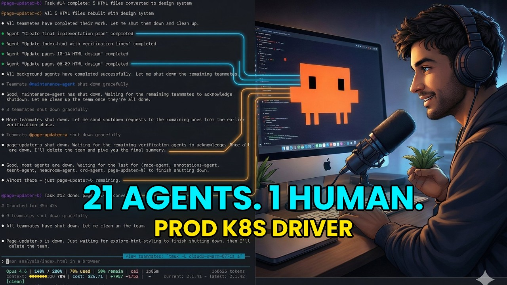

# anurag builds things

# anurag builds  intelligent systems  

I build things to understand how they actually work. A question, a system built to answer it, a comparison against real data. Just the code, the curves, and what they actually mean.

### [The AI Tools I’ve Actually Used](posts/ai-tools-timeline.llms.md)

A running vertical timeline of the AI tools I’ve leaned on day-to-day - for coding, chat, research, and the work in between. Updated as I adopt new ones.

22 May 2026

### [Prompts I Keep Coming Back To](posts/prompts-i-keep-coming-back-to.llms.md)

A commonplace book - prompts and magic words I’ve collected from others and keep reaching for. Not mine; just my favorites. Growing as I find more.

21 May 2026

### [Claude Code Agent Teams on a Real Production Chore](posts/claude-code-agent-teams-real-work.llms.md)

I tried Claude Code’s experimental agent teams on an actual job - analyzing upstream divergence on Scality’s S3 CSI driver - not a toy demo. Field notes on what worked, what cost, and the three settings worth knowing.

03 Apr 2026

 ⌘K

All 0

Posts 0

Sections 0

Actions 0

↑↓navigate ↩open ⌘↩new tab escclose

search
